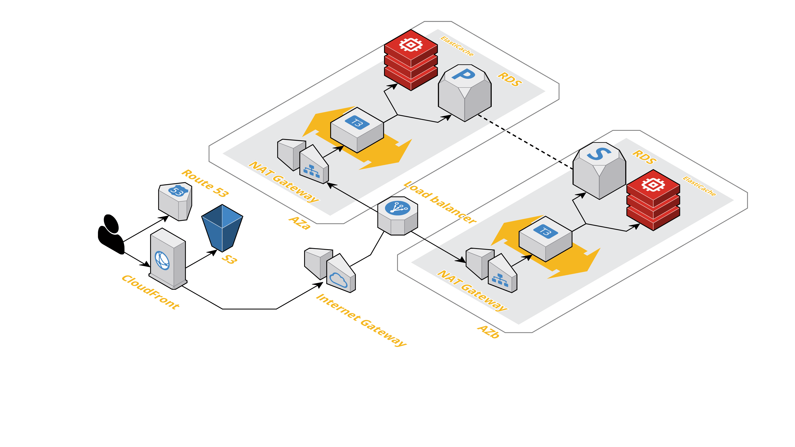

# AWS Symfony EC2 showroom

Showroom to demonstrate how deploy Symfony website in production with EC2 instances.

## Architecture

## Development

### Tools

Instead of use tfenv tool to manage Terraform version used to develop, we use a specific Docker image with Terraform, Git and SSH installed.
You *must* install this [extension](https://marketplace.visualstudio.com/items?itemName=ms-vscode-remote.remote-containers) to develop on this repository.

### Documentation

- [Enable access logs for your Application Load Balancer](https://docs.aws.amazon.com/elasticloadbalancing/latest/application/load-balancer-access-logs.html)
